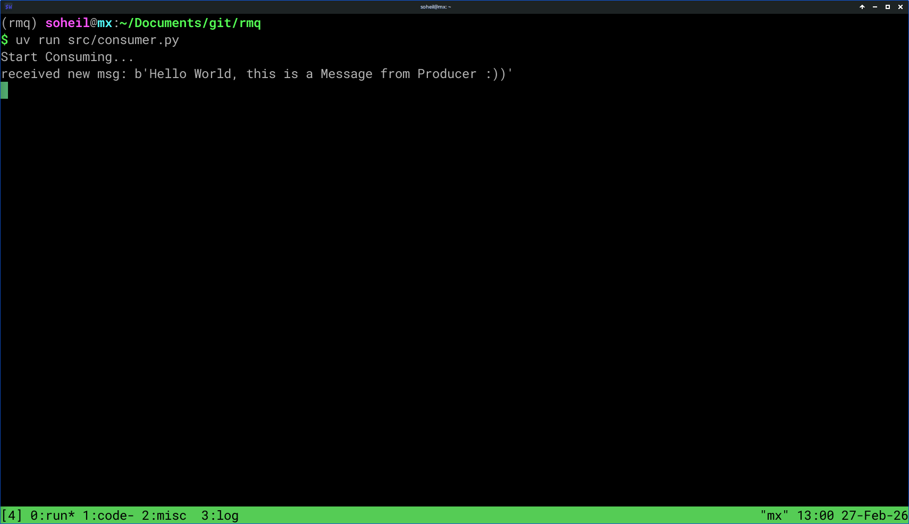
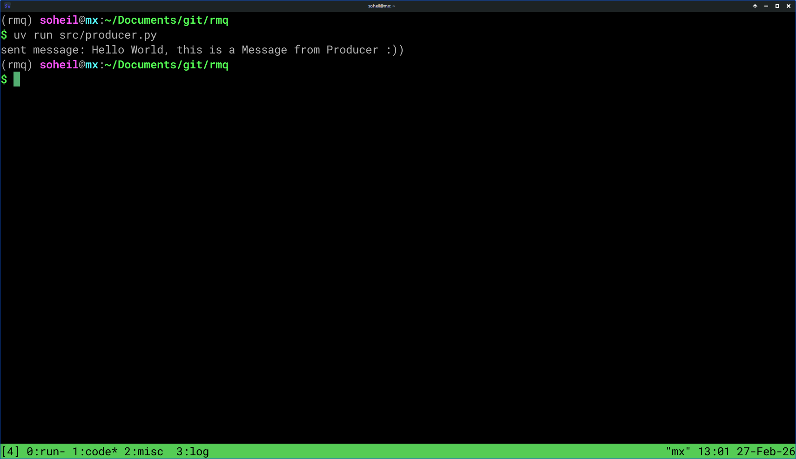

# rmq

RabbitMQ Stack 🐇

## Prerequisites

1 - **[Docker](https://www.docker.com/)/[Podman](https://podman.io/)**

3 - **Docker Image**

- [RabbitMQ](https://hub.docker.com/_/rabbitmq)

## Run

1 - First of All, Run RabbitMQ with Docker

```bash
sudo docker run -d --name some-rabbit --env RABBITMQ_DEFAULT_USER=admin --env RABBITMQ_DEFAULT_PASS=admin -p 15672:15672 -p 5672:5672 rabbitmq:4.2.4-management-alpine
```

2 - Clone the Repo

```bash
git clone https://github.com/soelz4/rmq.git
```

```bash
cd rmq
```

3 - Run Python Code

```bash
uv run src/consumer.py
```



```bash
uv run src/producer.py
```



Also you can see other Details in RabbitMQ


<p align="center">
  <picture>
    <source srcset="https://github-production-user-asset-6210df.s3.amazonaws.com/62666332/253642655-0438a9e1-d47d-4570-873c-5ddd59f46e9e.svg" width="100%" media="(prefers-color-scheme: light), (prefers-color-scheme: no-preference)" />
    <source srcset="https://github-production-user-asset-6210df.s3.amazonaws.com/62666332/253642655-0438a9e1-d47d-4570-873c-5ddd59f46e9e.svg" width="100%" media="(prefers-color-scheme: dark)" />
    
  </picture>
</p>
